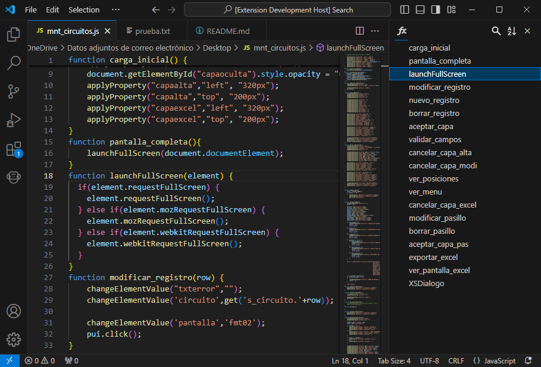
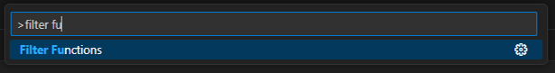

# Sidebar Function List

The Sidebar Function List extension adds an interactive list of functions to the right sidebar of Visual Studio Code, inspired by the functionality of Notepad++. 

This tool is ideal for developers working on projects with large files or long functions, as it allows for quick and efficient code navigation. 

## How to use

You only need to use the 'Show Function List' command at Command Palette.

Then you can see the function list at right sidebar. If you click one element you will navigate to the function declaration line!

You can also sort alphabetically or search the list with the icons above.

 Or by using the commands 'Sort Function List' and 'Filter Functions' if you prefer.

## Supported languages

At the moment, it works with all languages that use the 'function' keyword for function declaration, such as JavaScript or PHP.

Now also works with Python files.

## Github

Developed by Boniato, you can report issues at the [Github Repository](https://github.com/BoniatoRelleno/SidebarFunctionListVSC).

## License

[MIT License](LICENSE.md)

## Changelog

### 0.0.3

- Added alphabetical sorting
- Added search filter

### 0.0.2

- Changed minimum version to 1.64.0
- Added marketplace icon
- Function list icon changed
- Command 'Show Function List' result in error fixed

### 0.0.1

- Initial release

